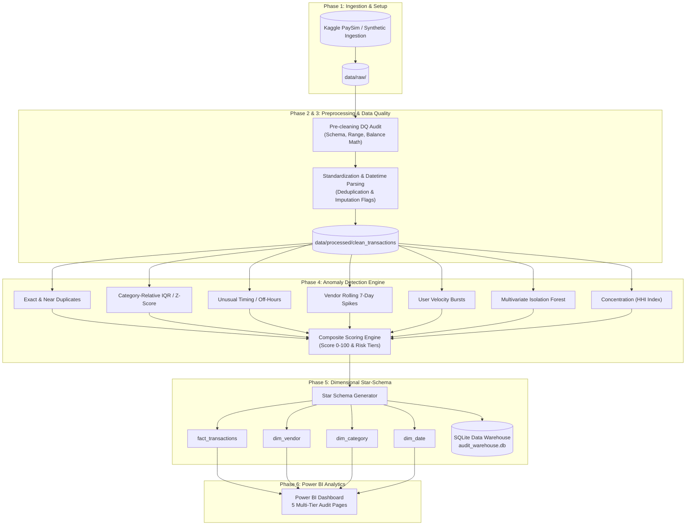

# 🛡️ Financial Audit & Transaction Fraud Detection Pipeline
### Enterprise-Grade Anomaly Detection, SQL Warehousing & Power BI Analytics

An end-to-end financial transaction monitoring and audit analytics system designed to detect payment fraud, velocity bursts, counterparty concentration, and multivariate anomalies across millions of banking records.

---

## 🏗️ Architecture Overview



---

## 📊 Anomaly Signals & Detection Thresholds

| Anomaly Signal | Methodology / Model | Operational Threshold | Anomaly Weight |
|---|---|---|---|
| **Exact Duplicates** | Identical record hashing | Exact match on `user`, `dest`, `amount`, `step`, `type` | 25 pts |
| **Near-Duplicates** | Temporal proximity window | Same `user`, `dest`, and `amount` within $\le 2$ hours | 25 pts |
| **Large Transactions** | Category-segmented IQR & Z-score | $Amount > Q3 + 2.5 \times IQR$ per transaction category | 20 pts |
| **Vendor Activity Spike** | Rolling historical baseline | Daily transactions $> \mu_{7\text{-day}} + 2.5 \times \sigma_{7\text{-day}}$ | 20 pts |
| **Velocity Burst** | Sliding temporal window | $\ge 3$ transactions by same user within $\le 2$ hours | 15 pts |
| **Multivariate Outlier** | Unsupervised Isolation Forest | Top $1.5\%$ anomalies across amount, velocity, hour, balances | 15 pts |
| **Unusual Timing** | Off-hours & vendor profiling | 1:00 AM – 5:00 AM window OR outside vendor 5th–95th percentile | 10 pts |
| **Spend Concentration** | Herfindahl-Hirschman Index (HHI) | User $HHI \ge 0.85$ with $\ge 3$ transactions | 10 pts |

### Composite Risk Tiers:
- **`CRITICAL` (Score 75–100):** Immediate transaction freeze and mandatory AML review.
- **`HIGH` (Score 45–74):** Automated queue to Tier-1 auditor with audit reason codes.
- **`MEDIUM` (Score 20–44):** Step-up biometric / OTP authentication.
- **`LOW` (Score 0–19):** Frictionless straight-through processing.

---

## 🚀 Quickstart & Reproduction Guide

### 1. Prerequisites & Environment
Ensure Python 3.9+ is installed:
```bash
pip install -r requirements.txt
```

### 2. Configure Kaggle Token (Optional for Kaggle PaySim)
Place your Kaggle API token at `~/.kaggle/access_token` or set the environment variable:
```bash
# Windows PowerShell
$env:KAGGLE_API_TOKEN="KGAT_your_token_here"
python -m kaggle datasets download -d ealaxi/paysim1 -p ./data/raw --unzip
```

### 3. Generate Synthetic Benchmark Dataset
If you prefer immediate testing or controlled ground-truth injection:
```bash
python scripts/generate_synthetic_data.py --rows 50000 --output ./data/raw/synthetic_paysim.csv
```

### 4. Execute Master End-to-End Pipeline
Run the full data quality audit, cleaning, anomaly scoring, and star-schema export:
```bash
python scripts/run_pipeline.py --input ./data/raw/synthetic_paysim.csv --outdir ./data/processed
```

### 5. Verify Unit Tests
Execute the automated test suite with pytest:
```bash
python -m pytest -v tests/test_pipeline.py
```

### 6. Query SQLite Data Warehouse
Verify the star schema and reporting views:
```bash
python scripts/test_sql.py
```

---

## 🗄️ Database Architecture (Star-Schema)

The data pipeline outputs to CSV, Parquet, and writes directly to `data/processed/audit_warehouse.db`:
- **`fact_transactions`**: Granular transaction records, surrogate keys, 7 individual anomaly flags, `anomaly_score`, `risk_level`, and human-readable `flag_reasons`.
- **`dim_vendor`**: Merchant master table enriched with realistic corporate brands, cumulative volume, flagged transaction counts, and `vendor_risk_tier`.
- **`dim_category`**: Payment type dimension (`PAYMENT`, `TRANSFER`, `CASH_OUT`, `DEBIT`, `CASH_IN`) with risk profiles.
- **`dim_date`**: Calendar date dimension (`date_key`, `year`, `quarter`, `month`, `day_of_week`, `is_weekend`).
- **`data_quality_summary`**: Audited column completeness and null counts before cleaning.

### Pre-built SQL Views
- `clean_transactions`: Full CTE preprocessing pipeline in SQL.
- `v_suspicious_transactions`: High-priority alerts ranked by anomaly score.
- `v_vendor_risk_summary`: Counterparty risk profiling.
- `v_daily_audit_trend`: Daily volume and anomaly rate overlay.
- `v_category_risk_breakdown`: Category-level exposure and anomaly rates.

---

## 📈 Power BI Reporting Suite

The pipeline provides complete Power BI assets in the `dashboard/` directory:
- **`dashboard/dax_measures.dax`**: 20+ production-grade DAX measures including `[Anomaly %]`, `[Flagged Value]`, `[Duplicates Count]`, and dynamic risk indicators.
- **`dashboard/powerbi_setup_guide.md`**: Complete layout guide for all 5 pages:
  1. **Executive Audit Overview:** KPI scorecards, daily volume/flagged trend, risk tier donut chart.
  2. **Vendor Risk & Counterparty Intelligence:** Top 15 suspicious vendors, transaction drill-through table with red conditional formatting.
  3. **Transaction Trends & Outliers:** 24-hour off-hours heatmap, multivariate Isolation Forest scatter plot.
  4. **Category Distribution & Concentration:** Spend treemap, category anomaly rates, HHI concentration histogram.
  5. **Data Quality & Pipeline Health:** Pre-pipeline completeness matrix, schema validation cards, confusion matrix.

---

## 💡 Strategic Trade-Offs (False Positives vs. False Negatives)

In fraud detection, model evaluation is dominated by **cost asymmetry**:
- **False Negatives (Missed Fraud):** Cause catastrophic capital losses, regulatory fines, and chargeback fees.
- **False Positives (False Alarms):** Create customer friction, abandoned carts, and human auditor investigation costs.

Read the detailed write-up: **[docs/false_positives_tradeoffs.md](file:///c:/Users/vinay/Desktop/Projects/data%20science/audit/docs/false_positives_tradeoffs.md)**.
